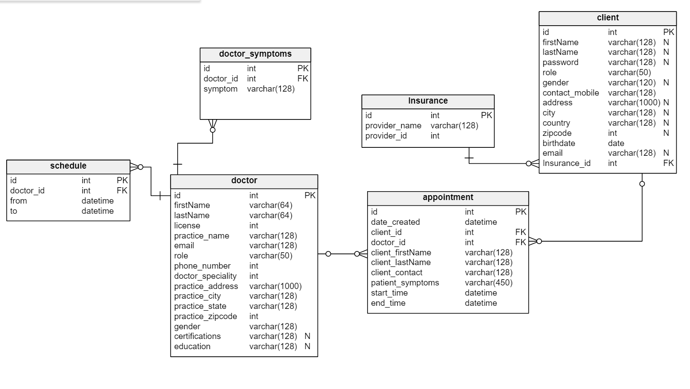

# P3 SymptoMedic - Find a Doctor

## Description

Our vision is to empower patients, their right to healthier, happier, lives by enabling easy access to the right doctor at the right time through symptom-based recommendations with no hidden consult fees, and free community support through our marketplace.

Deployed Website [here](http://symptomedic-ui.eastus.cloudapp.azure.com)
    

## Table of Contents 
* [Installation](#Installation) 
* [Technologies](#Technologies)
* [License](#License) 
* [Test](#Test) 

    

## Installation

You'll need .NET5, Node.JS, and Entity Framework on a local SQL database. Please note the appsettings.json will need a Connection String for the DB, and a secret for the Json Web Token authorization. 

## Technologies

- C#
- Asp.Net Core 5
- Entity Framework
- Angular
- Azure DB, Web services, Dev Ops
- Docker
- Kubernetes
- Json Web Token
- Bootstrap / Angular Material UI

## ER Diagram

## Flow

## License

    
This project falls under the mit license. Please visit [mit](https://choosealicense.com/licenses/mit) to learn more.
    

## Test

This application uses Unix Testing for the backend. Simply navigate to the Tests folder and use dotnet test. Angular uses Jasmine for frontend testing. 
    

## Questions
The author of this project is Ryan Earles, Sean Fitzmaurice, Chris Mesidor, Ashlie Nguyen, Keegan Wedwick, and Jorge Yumiseba.
    
   
